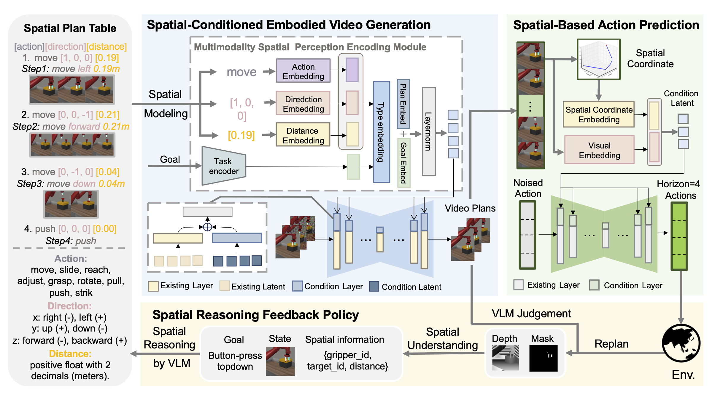

# SpatialPolicy: Spatial-Aware Video Policies for Robotic Manipulation

**Spatial Policy (SpatialPolicy, SP)** is a visuomotor robotic manipulation framework for **robot learning and embodied AI**. It connects **spatial reasoning**, **video generation**, and **action prediction** through explicit spatial modeling: spatial-conditioned video policies produce visual plans, a flow-based module predicts actions, and a feedback policy refines the spatial plan through dual-stage replanning.

This is the **official video-policy training code** for [Spatial Policy: Guiding Visuomotor Robotic Manipulation with Spatial-Aware Modeling and Reasoning](https://arxiv.org/abs/2508.15874). It provides diffusion-based video-policy training and inference for **Meta-World** and **iTHOR**, with [pretrained checkpoints on Hugging Face](https://huggingface.co/Junjun2333/SpatialPolicy). The [experiment repository](https://github.com/PlantPotatoOnMoon/SP_exp) contains the Meta-World and iTHOR experiment setup.

NEWS: We have released another repository for running our Meta-World and iTHOR experiments (https://github.com/PlantPotatoOnMoon/SP_exp)!

[Project website](https://plantpotatoonmoon.github.io/SpatialPolicy/) · [Paper / arXiv](https://arxiv.org/abs/2508.15874) · [Pretrained models](https://huggingface.co/Junjun2333/SpatialPolicy) · [Experiments](https://github.com/PlantPotatoOnMoon/SP_exp) · [Citation / BibTeX](citation.bib) · [中文简介](#中文简介)



## Getting started  

We recommend to create a new environment with pytorch installed using conda.   

```bash  
conda create -n spatialpolicy python=3.9
conda activate spatialpolicy
conda install pytorch torchvision torchaudio pytorch-cuda=11.8 -c pytorch -c nvidia
```  

Next, clone the repository and install the requirements  

```bash
git clone https://github.com/PlantPotatoOnMoon/SpatialPolicy
cd SpatialPolicy
pip install -r requirements.txt
```


## Dataset structure

The pytorch dataset classes are defined in `flowdiffusion/datasets.py`


## Training models

For Meta-World experiments, run
```bash
cd flowdiffusion
python train_mw.py --mode train
# or python train_mw.py -m train
```

or run with `accelerate`
```bash
accelerate launch train_mw.py
```

For iTHOR experiments, run `train_thor.py` instead of `train_mw.py`  
For real experiments, run `train_real.py` instead of `train_mw.py`  
will upload soon

The trained model should be saved in `../results` folder  

To resume training, you can use `-c` `--checkpoint_num` argument.  
```bash
# This will resume training with 1st checkpoint (should be named as model-1.pt)
python train_mw_feedback.py --mode train -c 1
```

## Inferencing

Use the following arguments for inference  
`-p` `--inference_path`: specify input video path  
`-t` `--text`: specify the text discription of task   
`-n` `sample_steps` Optional, the number of steps used in test time sampling. If the specified value less than 100, DDIM sampling will be used.  
`-g` `guidance_weight` Optional, The weight used for classifier free guidance. Set to positive to turn on classifier free guidance.   

For example:  
```bash
python train_mw.py --mode inference -c 4652204 -p ../examples/assembly.gif -t assembly -g 2 -n 20
```

## Pretrained models 

We also provide checkpoints of the models described in our experiments as following.   
### Meta-World
[SpatialPolicy/Meta-World](https://huggingface.co/Junjun2333/SpatialPolicy/tree/main/ckpts/metaworld/video)

### iThor
[SpatialPolicy/iThor](https://huggingface.co/Junjun2333/SpatialPolicy/tree/main/ckpts/thor/video)

### Real
will upload soon

## Acknowledgements

This codebase is modified from the following repositories:  
[avdc](https://github.com/flow-diffusion/AVDC)
[Videoagent](https://github.com/Video-as-Agent/VideoAgent)

## 中文简介

**Spatial Policy（SpatialPolicy）** 是通过空间感知建模与推理进行视觉运动机器人操作的具身智能框架，结合空间条件视频生成、动作预测与反馈重规划。本仓库提供视频策略的训练与推理代码，以及 Meta-World 和 iTHOR 的预训练模型入口；完整实验配置见 [SP_exp](https://github.com/PlantPotatoOnMoon/SP_exp)。

## Citation

If you use SpatialPolicy code or pretrained models, please cite the paper below. [Download BibTeX](citation.bib).

```bibtex
@article{liu2025spatialpolicy,
  title         = {Spatial Policy: Guiding Visuomotor Robotic Manipulation with Spatial-Aware Modeling and Reasoning},
  author        = {Liu, Yijun and Liu, Yuwei and Meng, Yuan and Zhang, Jieheng and Zhou, Yuwei and Li, Ye and Jiang, Jiacheng and Ji, Kangye and Ge, Shijia and Wang, Zhi and Zhu, Wenwu},
  journal       = {arXiv preprint arXiv:2508.15874},
  year          = {2025},
  eprint        = {2508.15874},
  archivePrefix = {arXiv},
  primaryClass  = {cs.RO},
  doi           = {10.48550/arXiv.2508.15874},
  url           = {https://arxiv.org/abs/2508.15874}
}
```
