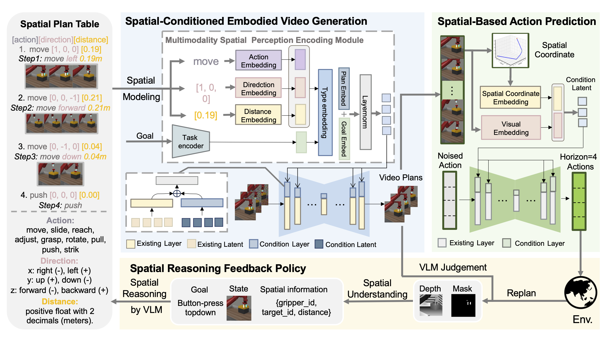

## Spatial Policy

The official codebase for training video policies in SpatialPolicy

This repository contains the code for training video policies presented in our work   
[Spatial Policy: Guiding Visuomotor Robotic Manipulation with Spatial-Aware Modeling and Reasoning](https://arxiv.org/abs/2508.15874)  

NEWS: We have released another repository for running our Meta-World and iTHOR experiments (https://github.com/PlantPotatoOnMoon/SP_exp)!

[website](https://plantpotatoonmoon.github.io/SpatialPolicy) | [paper](https://arxiv.org/abs/2508.15874) | [arXiv](https://arxiv.org/abs/2508.15874) | [experiment repo]()



## Getting started  

We recommend to create a new environment with pytorch installed using conda.   

```bash  
conda create -n spatialpolicy python=3.9
conda activate spatialpolicy
conda install pytorch torchvision torchaudio pytorch-cuda=11.8 -c pytorch -c nvidia
```  

Next, clone the repository and install the requirements  

```bash
git clone https://github.com/PlantPotatoOnMoon/SpatialPolicy
cd SpatialPolicy
pip install -r requirements.txt
```


## Dataset structure

The pytorch dataset classes are defined in `flowdiffusion/datasets.py`


## Training models

For Meta-World experiments, run
```bash
cd flowdiffusion
python train_mw.py --mode train
# or python train_mw.py -m train
```

or run with `accelerate`
```bash
accelerate launch train_mw.py
```

For iTHOR experiments, run `train_thor.py` instead of `train_mw.py`  
For real experiments, run `train_real.py` instead of `train_mw.py`  
will upload soon

The trained model should be saved in `../results` folder  

To resume training, you can use `-c` `--checkpoint_num` argument.  
```bash
# This will resume training with 1st checkpoint (should be named as model-1.pt)
python train_mw_feedback.py --mode train -c 1
```

## Inferencing

Use the following arguments for inference  
`-p` `--inference_path`: specify input video path  
`-t` `--text`: specify the text discription of task   
`-n` `sample_steps` Optional, the number of steps used in test time sampling. If the specified value less than 100, DDIM sampling will be used.  
`-g` `guidance_weight` Optional, The weight used for classifier free guidance. Set to positive to turn on classifier free guidance.   

For example:  
```bash
python train_mw.py --mode inference -c 4652204 -p ../examples/assembly.gif -t assembly -g 2 -n 20
```

## Pretrained models 

We also provide checkpoints of the models described in our experiments as following.   
### Meta-World
[SpatialPolicy/Meta-World](https://huggingface.co/Junjun2333/SpatialPolicy/tree/main/ckpts/metaworld/video)

### iThor
[SpatialPolicy/iThor](https://huggingface.co/Junjun2333/SpatialPolicy/tree/main/ckpts/thor/video)

### Real
will upload soon

## Acknowledgements

This codebase is modified from the following repositories:  
[avdc](https://github.com/flow-diffusion/AVDC)
[Videoagent](https://github.com/Video-as-Agent/VideoAgent)

